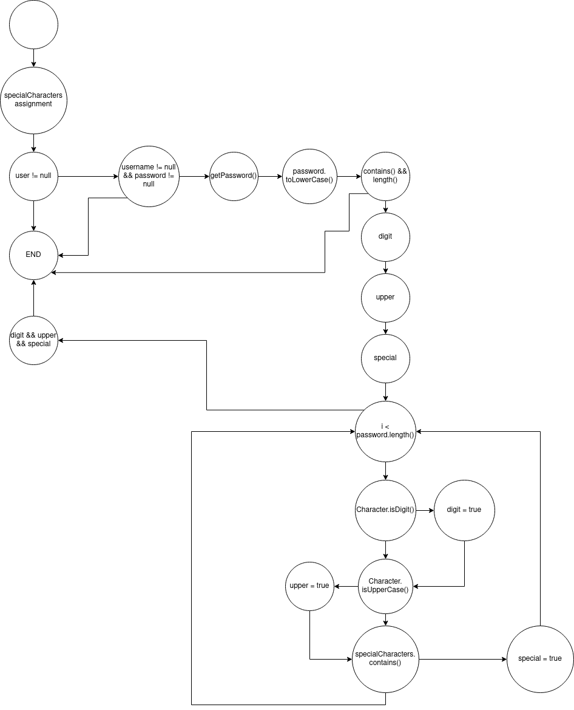

# Втора лабораториска вежба по Софтверско инженерство

## Дарјан Живадиновиќ, бр. на индекс 163064

### Група на код: 

Ја добив групата на код 4

###  Control Flow Graph

### Цикломатска комплексност

### Тест случаи според критериумот Multiple Condition

        assertFalse(cls.function(new User(null, null, "email@email.com"), new ArrayList<>()));

        assertFalse(cls.function(new User("null", null, "email@email.com"), new ArrayList<>()));

        assertFalse(cls.function(new User("darjanz", null, "email@email.com"), new ArrayList<>()));

        assertFalse(cls.function(new User("darjanz", "darjanzz", null), new ArrayList<>()));

        assertFalse(cls.function(new User("darjanz", "blabla", null), new ArrayList<>()));

        assertFalse(cls.function(new User("darjanz", "blablabla", null), new ArrayList<>()));

        assertFalse(cls.function(new User("darjanz", "Password", "email@email.com"), new ArrayList<>()));

        assertFalse(cls.function(new User("darjanz", "1Password", "email@email.com"), new ArrayList<>()));

        assertTrue(cls.function(new User("darjanz", "1pAssword^", "email@email.com"), new ArrayList<>()));

### Тест случаи според критериумот Every Branch

        assertFalse(cls.function(null, new ArrayList<>()));

        assertFalse(cls.function(new User("darjanz", "password", "email@email.com"), new ArrayList<>()));

        assertFalse(cls.function(new User("darjanz", "darjanzz", "email@email.com"), new ArrayList<>()));

        assertFalse(cls.function(new User("darjanz", "blabla", "email@email.com"), new ArrayList<>()));

        assertFalse(cls.function(new User("darjanz", "Password", "email@email.com"), new ArrayList<>()));

        assertFalse(cls.function(new User("darjanz", "1Password", "email@email.com"), new ArrayList<>()));

        assertTrue(cls.function(new User("darjanz", "1pAssword^", "email@email.com"), new ArrayList<>()));

### Објаснување на напишаните unit tests

Multiple Condition тестовите ги тестираат можните исходи од compound условите (пр. `if (username != null && password != null)`), додека пак Every Branch тестовите ги тестираат исходите од секоја точка на гранење во кодот.
